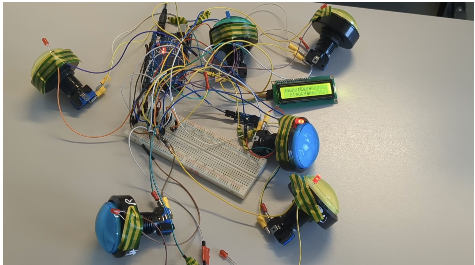
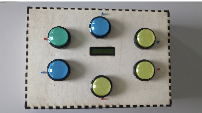

# ⚡ Embedded Whac-A-Mole (Tape-Taupe)

<div align="center">

[]()
[]()
[]()

<br/>

[🇺🇸 English Version](#-english-version) | [🇫🇷 Version Française](#-version-française)

</div>

---

# 🇺🇸 English Version

## 📝 Overview

A custom-built electronic version of the famous **Whac-A-Mole** game.

This project was fully designed and developed in **C++ using Arduino microcontrollers**, combining embedded programming and electronic circuit design.

The system features:

- 🎮 Real-time interaction  
- 📟 Live LCD display (score & timer)  
- 🔊 Audio feedback via buzzer  
- 📈 Progressive difficulty with special "trap" events  

**Context:** Engineering Project (L2 Level)  
**Role:** Co-creator (Hardware & Software) with Titouan D.

---

## ⚙️ Technical Specifications

### 🧠 Microcontroller
- **Arduino Mega 2560**

### 🎛️ Inputs
- 6 × Arcade Push Buttons  
- Wired using **Pull-down resistors**

### 💡 Outputs
- 6 × LEDs (visual signals)
- **I2C LCD Screen** (score & timer display)
- **Active Buzzer** (audio feedback)

### 🧮 Game Logic
- Randomized mole generation
- Non-blocking timing system
- “Trap” events (penalty if wrong button is pressed)
- Progressive difficulty scaling

---

## 📸 Prototype & Gallery

| Circuit Logic | Final Build | Code Scheme |
| :---: | :---: | :--: |
|  |  |  |
| *Electronic wiring and logic components* | *Fully assembled functional casing* | *Organigram* |

---

## 💻 Software Architecture

The program is built around:

- **Non-blocking timing using `millis()`**
- Arrays to efficiently manage the 6 inputs
- Event-driven logic
- Real-time responsiveness without freezing the processor

### 🔎 Example: Non-blocking input listener

```cpp
// Example: Non-blocking input listener
bool waitForInput(int btnIndex, int timeout) {
  unsigned long startTime = millis();

  while (millis() - startTime < timeout) {
    if (digitalRead(PIN_BOUTONS[btnIndex]) == HIGH) {
      return true; // Button pressed
    }
  }

  return false; // Timeout reached
}
```

This approach ensures:

- ✅ The microcontroller remains responsive  
- ✅ Multiple events can be handled efficiently  
- ✅ No blocking delays (`delay()`) are used  

---

# 🇫🇷 Version Française

## 📝 Présentation

Une version électronique personnalisée du célèbre jeu **Tape-Taupe (Whac-A-Mole)**.

Ce projet a été entièrement conçu et développé en **C++ sur microcontrôleur Arduino**, en combinant programmation embarquée et conception électronique.

Le système propose :

- 🎮 Une interaction en temps réel  
- 📟 Un affichage dynamique sur écran LCD (score & chronomètre)  
- 🔊 Un retour sonore via buzzer  
- 📈 Une difficulté progressive avec événements "piège"  

**Contexte :** Projet d’ingénierie (niveau L2)  
**Rôle :** Co-créateur (Matériel & Logiciel) avec Titouan D.

---

## ⚙️ Spécifications Techniques

### 🧠 Microcontrôleur
- **Arduino Mega 2560**

### 🎛️ Entrées
- 6 × Boutons d’arcade  
- Câblage avec résistances **Pull-down**

### 💡 Sorties
- 6 × LEDs (signaux visuels)
- **Écran LCD I2C** (affichage score & chronomètre)
- **Buzzer actif** (retour sonore)

### 🧮 Logique du jeu
- Génération aléatoire des cibles
- Gestion du temps en non-bloquant
- Événements “piège” (pénalité si mauvais bouton pressé)
- Augmentation progressive de la difficulté

---

## 💻 Architecture Logicielle

Le programme repose sur :

- L’utilisation de **`millis()`** pour éviter les délais bloquants  
- Des **tableaux de pins** pour gérer efficacement les 6 entrées  
- Une logique événementielle  
- Une gestion temps réel optimisée

### 🔎 Exemple : écoute non-bloquante d’un bouton

```cpp
// Exemple : écoute non-bloquante d’un bouton
bool waitForInput(int btnIndex, int timeout) {
  unsigned long startTime = millis();

  while (millis() - startTime < timeout) {
    if (digitalRead(PIN_BOUTONS[btnIndex]) == HIGH) {
      return true; // Bouton pressé
    }
  }

  return false; // Temps écoulé
}
```

Cette approche permet :

- ✅ De ne pas bloquer le microcontrôleur  
- ✅ De gérer plusieurs événements simultanément  
- ✅ D’assurer une réactivité constante  

---

## 🚀 Skills Demonstrated / Compétences mises en œuvre

- Embedded Programming (C++ / Arduino)
- Real-Time System Design
- Electronic Circuit Design
- Hardware/Software Integration
- Debugging (Hardware & Firmware)
- Functional Prototyping

---

## 🏁 Conclusion

This project demonstrates a complete embedded system workflow —  
from circuit design to firmware development and final product integration.

Ce projet illustre une approche complète d’un système embarqué,  
de la conception électronique jusqu’à l’intégration logicielle finale.

---
